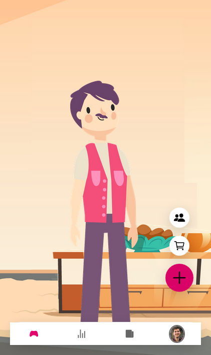
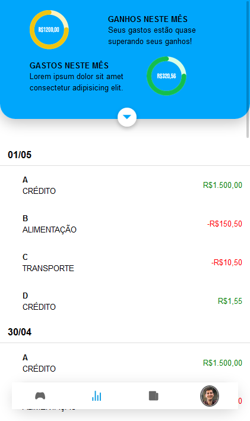
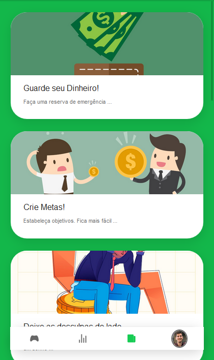
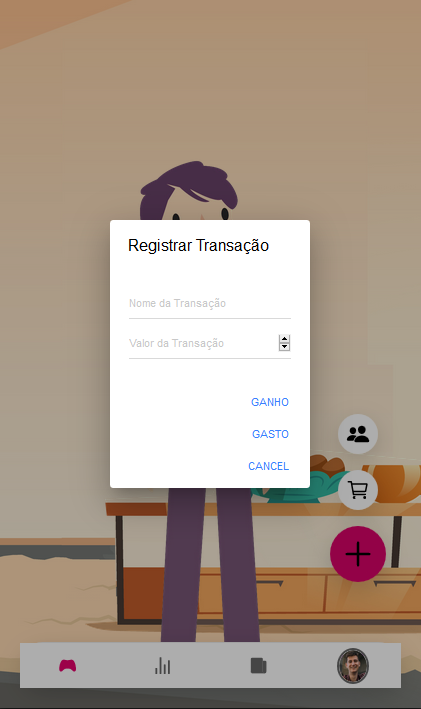

# Let Your Story Flourish

App criado para o Megahack 2020-1

---

Conteúdo

1.  [Requisitos](#requisitos)
2.  [Descrição do Problema](#descrição-do-problema)
3.  [Proposta de Solução](#proposta-de-solução)
4.  [Imagens](#imagens)

---

## Requisitos

Para executar esse código, é necessário:

- Instalar [Node.js](https://nodejs.org) (v12.16.3)
- Rodar **npm install** para instalar as dependências

## Descrição do Problema

Com base em nossa pesquisa de campo foi possível compreender que a maior deficiência de jovens brasileiros relacionado ao mundo das finanças é a falta de organização decorrente do incentivo desenfreado ao consumo durante a vida e pouco (ou nenhum) complemento educacional sobre como realizar esse consumo de forma consciente. O problema de negócio o qual buscamos a solução foca em resolver o baixo índice de brasileiros que hoje dedicam tempo a sua vida financeira por acharem a tarefa algo chato e entediante.

- 9% da população poupou em 2017 e menos da metade (42%) tem algum dinheiro guardado.
- “As pessoas declaram falta de conhecimento sobre as próprias finanças.” “Importante, porém uma tarefa bem chata”.

## Proposta de Solução

Nossa solução consiste em um educador multisensorial, para ajudar o usuário a manter controle sobre suas finanças. O diferencial da nossa proposta é que nosso aplicativo contém um jogo virtual, onde o usuário consegue receber recompensas com base em sua economia; podendo ter uma casa, adquirindo móveis e roupas para seu personagem ao concluir missões relacionadas a poupança e alcance de metas propostas pelo próprio jogador.
Para aumentar o engajamento do game, existe a possibilidade de adicionar amigos no jogo, podendo parabenizá-los pelo progresso.
Além disso, o usuário ainda conta com uma visão analítica das suas despesas, podendo ver um resumo dos seus gastos em um período de tempo por categoria, e até um sistema de previsão simples, mostrando o progresso e sua economia. Por último, oferecemos uma tela de notícias e dicas financeiras, auxiliando o usuário no seu aprendizado.

Em suma, nosso aplicativo contém:

- Visão Analítica: Gráficos e estatísticas sobre seus dados, para as pessoas que queiram ter maior controle sobre todos seus gastos e economias;
- Visão Gamificada: Parte principal do sistema, um personagem e uma casa para o jogador, onde o mesmo possa ter noção de progresso e recompensas por economizar dinheiro e cumprir metas de longo prazo;
- Notícias e dicas: Uma tela contendo informações e dicas sobre economia, investimentos, e assustos da área.

## Imagens

A seguir, veja algumas imagens da aplicação.

### Tela inicial

### Detalhes das transações

### Projeções

### Conteúdo

### Perfil

### Criação de transação

